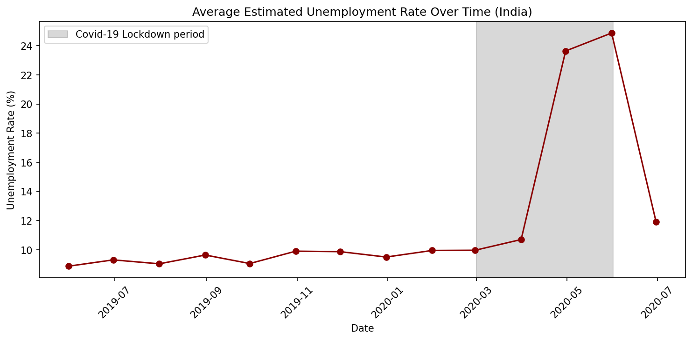
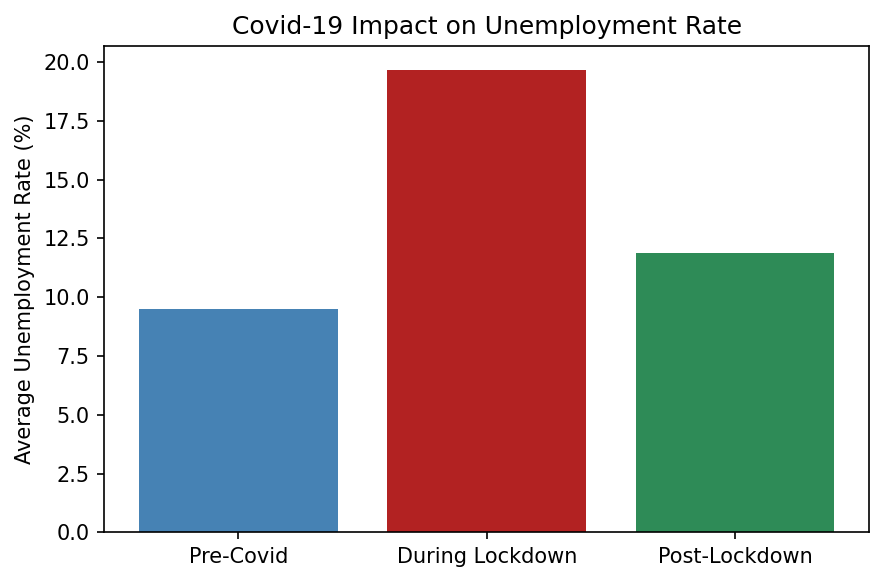
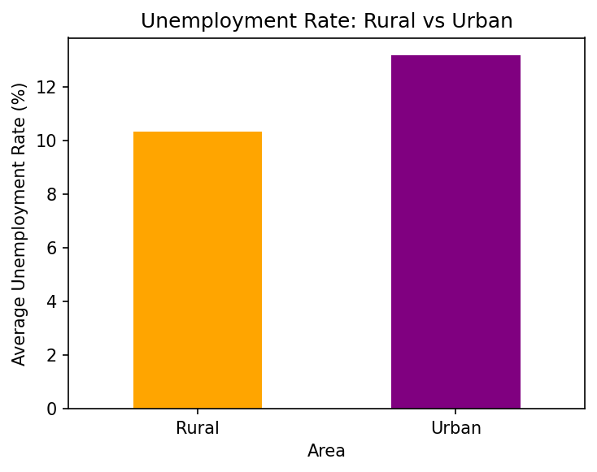
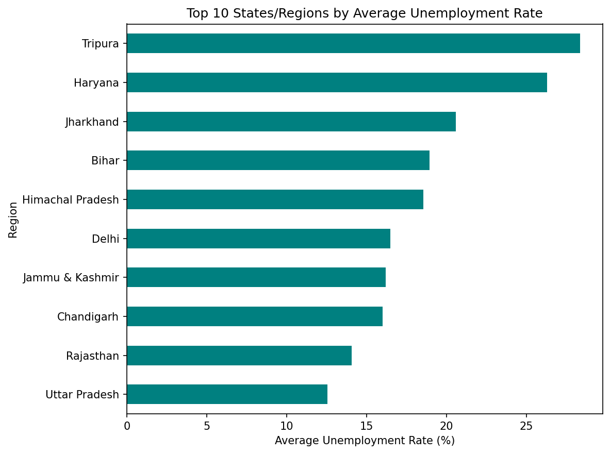
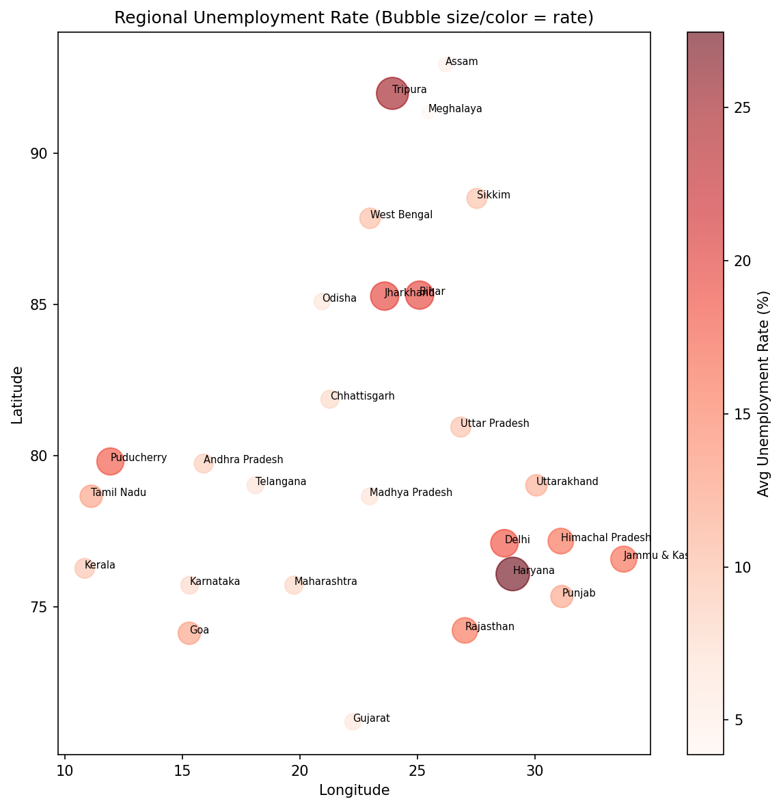
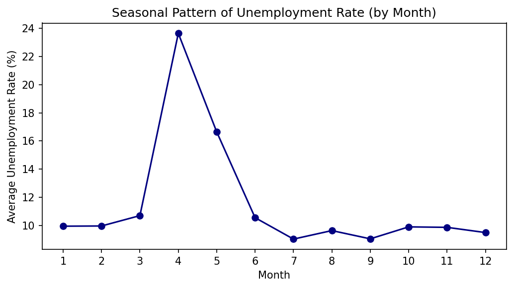
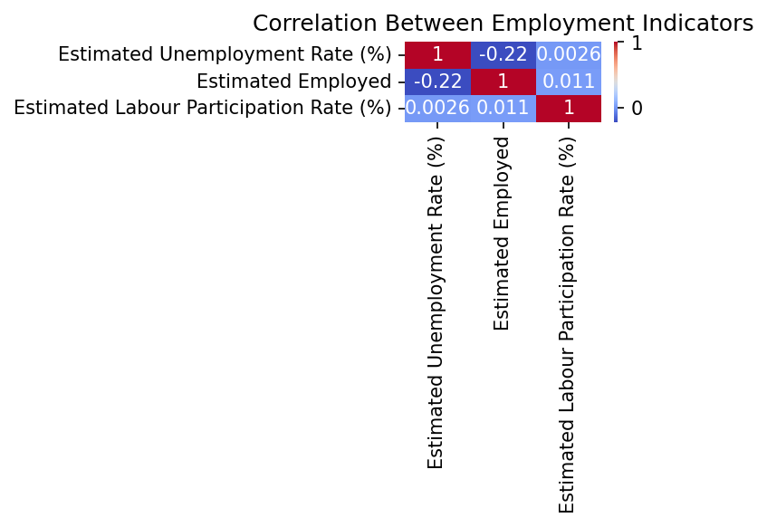

# 📉 Unemployment Analysis with Python

A data analysis project exploring India's unemployment rate trends, investigating the impact of Covid-19, and identifying regional, seasonal, and rural/urban patterns.
---

## Overview

Unemployment is one of the most critical indicators of economic health, and the Covid-19 pandemic caused one of the sharpest disruptions to labor markets in recent history. This project cleans and merges two real-world Indian unemployment datasets, then explores how the unemployment rate evolved over time, how it differs across states, rural vs. urban areas, and months of the year — with a specific focus on quantifying the Covid-19 lockdown's impact.

##  Datasets

Two complementary datasets were used:

| Dataset | Description |
|---|---|
| `Unemployment_in_India.csv` | State/region-level unemployment rate, employed population, and labour participation rate over time |
| `Unemployment_Rate_upto_11_2020.csv` | Region-level unemployment data including geographic coordinates (latitude/longitude), used for the regional map |

**Key columns:**

| Column | Description |
|---|---|
| `Region` | Indian state/union territory |
| `Date` | Observation date |
| `Area` | Rural / Urban |
| `Estimated Unemployment Rate (%)` | Target metric |
| `Estimated Employed` | Number of employed individuals |
| `Estimated Labour Participation Rate (%)` | Share of the working-age population in the labor force |

##  Tech Stack

- **Python 3**
- **Pandas** – data cleaning, merging & aggregation
- **Matplotlib / Seaborn** – data visualization

##  Project Workflow

1. **Data Loading & Cleaning** — Loaded both datasets, stripped whitespace from column names and string values, dropped a duplicate region column, removed missing rows, and parsed date fields.
2. **Feature Extraction** — Extracted the observation month from each date to support seasonal analysis.
3. **Overall Statistics** — Summarized the distribution of the national unemployment rate.
4. **Time-Trend Analysis** — Plotted the national average unemployment rate over time, highlighting the Covid-19 lockdown window.
5. **Covid-19 Impact Analysis** — Compared average unemployment rate before, during, and after the lockdown period.
6. **Rural vs. Urban Comparison** — Compared average unemployment rates between rural and urban areas.
7. **Regional Analysis** — Ranked India's states/regions by average unemployment rate and visualized the top 10.
8. **Seasonal Pattern Analysis** — Examined how unemployment rate varies by calendar month.
9. **Geographic Visualization** — Built a bubble map using latitude/longitude to show regional unemployment intensity.
10. **Correlation Analysis** — Examined the relationship between unemployment rate, employed population, and labour participation rate.

##  Results & Insights

### National Unemployment Trend

The unemployment rate stayed relatively stable (around 9–10%) through 2019 and early 2020, then spiked dramatically during the Covid-19 lockdown period, before beginning to recover afterward.



### Covid-19 Impact

Covid-19 more than doubled the national unemployment rate — jumping from an average of roughly **9.5% pre-Covid** to nearly **20% during the lockdown**, before easing to around **12% post-lockdown**, still well above pre-pandemic levels.



### Rural vs. Urban Unemployment

Urban areas experienced a noticeably higher average unemployment rate (~13.2%) than rural areas (~10.3%) — likely reflecting the greater exposure of urban jobs to lockdown restrictions and service-sector shutdowns.



### Top 10 States/Regions by Unemployment Rate

**Tripura** and **Haryana** recorded the highest average unemployment rates (above 25%), followed by Jharkhand and Bihar — highlighting significant regional disparity across India's labor markets.



### Regional Map

The bubble map visualizes unemployment intensity by region, with larger and darker bubbles marking states like Haryana and Tripura as the hardest-hit areas geographically.



### Seasonal Pattern

Unemployment rate shows a sharp, isolated spike around **April–May** (coinciding with the 2020 lockdown) rather than a recurring yearly seasonal cycle — the rest of the year stays fairly flat around 9–10%.



### Correlation Between Employment Indicators

Unemployment rate shows a **weak negative correlation** with estimated employed population (-0.22) and essentially **no correlation** with labour participation rate — suggesting the rate spike was driven more by job losses among the existing labor force than by shifts in workforce participation.



##  How to Run

1. Clone the repository:
   ```bash
   git clone https://github.com/<your-username>/Unemployment_Analysis.git
   cd Unemployment_Analysis
   ```

2. Install the required dependencies:
   ```bash
   pip install pandas matplotlib seaborn
   ```

3. Run the script:
   ```bash
   python unemployment_analysis.py
   ```

The script will print dataset info and summary statistics to the console, and save all visualizations (trend, Covid-19 impact, rural vs. urban, top regions, regional map, seasonal pattern, correlation heatmap) as `.png` files in the project directory.

##  Project Structure

```
CodeAlpha_Unemployment_Analysis/
│
├── Unemployment_in_India.csv               # Dataset 1
├── Unemployment_Rate_upto_11_2020.csv      # Dataset 2 (with geo coordinates)
├── unemployment_analysis.py                # Main script
├── unemployment_trend_overall.png          # National unemployment trend over time
├── unemployment_covid_impact.png           # Pre/during/post lockdown comparison
├── unemployment_rural_vs_urban.png         # Rural vs urban comparison
├── unemployment_top10_regions.png          # Top 10 states by unemployment rate
├── unemployment_regional_map.png           # Geographic bubble map
├── unemployment_seasonal_pattern.png       # Monthly seasonal pattern
├── unemployment_correlation.png            # Correlation between employment indicators
└── README.md                               # Project documentation
```

## Key Takeaways

- Covid-19 caused a dramatic, temporary doubling of India's unemployment rate, peaking during the lockdown months.
- Urban areas were hit harder than rural areas by the lockdown-driven unemployment spike.
- Unemployment rates vary significantly by region, with Tripura and Haryana consistently ranking highest.
- The unemployment spike was an isolated pandemic-driven event rather than part of a recurring seasonal pattern.

